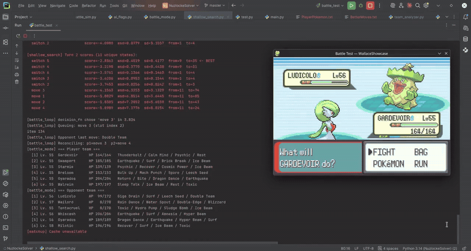

# NuzlockeSolver



*Beating Wallace, the Pokémon Emerald Champion. **Left:** the search reporting sampled states,
deduplication counts, per-action scores and its chosen move — including the opponent's move
probabilities, produced by a port of the game's own trainer AI. **Right:** the live emulator being
driven by injected button presses.*

An autopilot for **Pokémon Emerald**. It runs the ROM inside an embedded mGBA, reads live battle
state directly out of GBA memory, mirrors that state into a customized Pokémon Showdown simulator,
searches over the player's options while modelling the opponent with a reimplementation of the real
Emerald trainer AI, and then **injects the resulting button presses back into the emulator** to
play the turn.

It also has an offline arm that simulates every player-Pokémon × opponent-Pokémon matchup to pick
an optimal six-Pokémon team for a gym leader or Elite Four fight.

This was the first of three attempts at the problem:

1. **NuzlockeSolver** *(this repo)* — borrow a simulator, patch it for control, search stochastically.
2. **[NuzlockeAI-v1](https://github.com/Fracture17/NuzlockeAI-v1)** — build the engine from
   scratch, read the screen instead of memory, learn a value function. Archived.
3. **[NuzlockeAI](https://github.com/Fracture17/NuzlockeAI)** — a C++ engine and a solver that
   returns a *proof* that a position is winnable rather than an estimate.

---

## How it works

```
GBA memory → emerald_reader.py → battle_mode.py → ShallowSearchProcess
                                               ↓
                                    shallow_search.py  (python3.14t, GIL disabled)
                                               ↓
                              simulate_turn × N  (parallel workers → Node / Showdown)
                                               ↓
                              best_action → button injection → emulator
```

**Reading the game.** No OCR and no screen scraping — mGBA is embedded in-process through its
cffi bindings, and `emerald_reader.py` reads the Gen 3 party struct directly: 100-byte entries,
checksum-verified, **substructures decrypted** (PID/OTID XOR across all 24 orderings) to recover
species, moves, IVs, EVs, nature, ability and item, with level re-derived from EXP against growth
curves read out of ROM.

**Driving the game.** `battle_mode.py` synthesizes `(button bitmask, frame count)` sequences and
pushes them onto the emulator's input queue, exploiting the fact that Gen 3 move grids don't wrap
to reset the cursor deterministically. A state machine keyed on `gBattleCommunication[0]` with
debounce counters decides when the game is actually waiting for input.

**Keeping the simulator honest.** After every turn the observed outcome is replayed in Showdown
using the opponent's *actual* move — read from memory, not guessed — and HP, PP, status and
volatiles are patched back to match. Sim drift never accumulates. A separate validator decodes the
GBA text encoding and cross-checks the on-screen message against what memory claims, logging any
disagreement.

## The Showdown fork

The simulator is `@pkmn/sim`, customized through an ~800-line `patch-package` diff. The
interesting parts:

- **RNG made controllable.** `Battle.random` is overridden with per-side predicates — force crit,
  force miss, force hit, pin the damage roll high or low. This is what makes importance sampling
  possible: the searcher pins individual RNG factors instead of doing blind rollouts.
- **Probabilities exported.** Crit, accuracy and secondary-effect chances are written onto the
  battle object *at the moment of the roll*, so the search gets exact branch probabilities to
  weight samples with.
- **Trainer bag items as a battle action.** Vanilla Showdown has no concept of a trainer using a
  Full Restore mid-battle. The patch adds the item, a new `item` choice type with validation, and
  queue ordering for it.
- **Gym badge boosts.** Emerald gives the *player* a stat bump per badge; Showdown doesn't model it.
- **Gen 3 sleep semantics** under forced RNG, and Lum Berry status attribution so the optimizer can
  choose a specific cure berry over the generic one.

Python talks to it over a raw subprocess pipe with 4-byte length-prefixed JSON frames — no
websockets, no Showdown server. The battle is serialized to JSON every turn, so the simulator is
stateless between calls and any position can be forked or replayed.

Everything custom lives in [`showdown/`](showdown/) — the patch itself, `Connection.js` (the IPC
bridge), the gen-3 data extractors, and [`EDITS.md`](showdown/EDITS.md), which documents every
custom battle-object field and RNG control flag. Upstream Showdown is *not* vendored; `npm install`
pulls `@pkmn/sim` at the pinned version and `patch-package` reapplies the diff via a postinstall
hook:

```bash
cd showdown && npm install
```

## The search

A depth-limited expectimax-flavoured tree with **stratified importance sampling** — not MCTS,
which was tried and removed.

Every player action is expanded at each level; opponent actions are *sampled*. Each stochastic
factor (crit, accuracy, secondary effect, per side) carries a **Beta posterior**, and opponent move
choice a **Dirichlet**, with priors seeded from the exact probabilities the patched simulator
reports. Samples are importance-weighted and the tree aggregates weighted expectations. Identical
resulting states are deduplicated per depth by a binned fingerprint, so the tree is really a DAG.

Leaf evaluation is HP-differential with status and boost terms — and a **−20 penalty per player
Pokémon lost**, which is the Nuzlocke death cost written directly into the objective. A
risk-aversion knob can score only the worst fraction of the outcome mass instead of the mean.

Parallelism comes from **free-threaded CPython**: the searcher runs in a `python3.14t` subprocess
with the GIL disabled, ~15 worker threads, each owning its own Node simulator process.

**The opponent is not modelled as random or optimal.** `ai_flags.py` is a faithful port of
pokeemerald's `battle_ai_script_commands.c` — the real flag-based scoring the game's trainers use,
with per-trainer flag sets, and 8-bit RNG thresholds reproduced exactly. The switch-in AI is ported
the same way, **including its original bugs on purpose**: the NORMAL→GHOST immunity mishandling and
a modulo-256 damage overflow are reproduced, because the goal is to predict what the game will
actually do, not what it should do.

## Team selection

Offline, it evaluates every (player mon × opponent mon) pairing — plus switch-in-while-they-attack
variants — across item, TM and berry loadouts, caches the results, then brute-forces team
selection: all six-member combinations against all assignments of counters to opponents, subject
to resource conflicts (one of each TM, no duplicate species), parallelized across processes.

## Stack

| Area | LOC |
|---|---|
| Opponent AI model | 2,681 |
| Offline team analysis | 3,682 |
| Emulator / memory reading | 2,628 |
| Search + sim bridge | 2,346 |
| Live battle driver | 1,862 |
| Tests (213 functions) | 1,798 |
| **Python total** | **~16,300** |
| Custom JavaScript | ~700 |

Python 3.14 (plus 3.14t free-threaded for the searcher) and Node.js. Dependencies are deliberately
minimal — numpy, pygame, sounddevice, cffi, pytest; mGBA is a local source build.

## Status

**Working and used.** It played real battles through real gym leaders and Elite Four fights; the
repo's history includes completed matchup analyses and a large body of turn-by-turn validation logs
from live runs.

**Unfinished.** Development stopped mid-stream:

- The **Run & Bun romhack port** is roughly 80% — data tables extracted and memory offsets threaded
  through, but parked mid-port with the config switched back to vanilla.
- The last recorded session ended on a **sim/memory desync around trainer item usage**, which is
  where debugging stopped.
- Configuration is hand-edited per battle — badges, the opponent's bag, available TMs and items are
  set in `config.py` before each fight. It's a power-user cockpit, not a push-button product.
- Some documentation has drifted from the code (documented reward weights and search depth no
  longer match the implementation).

The lesson that carried into the successor projects: patching someone else's simulator gets you
running fast, but every mechanic the host doesn't model becomes a patch, and every patch is a place
your model can silently disagree with the real game. That reconciliation cost is what motivated
building the engine from scratch next time.

## Game data

Contains no ROM and no savestates. Running it requires your own legally-obtained copy of Pokémon
Emerald and a local mGBA build.

## License

MIT — see [LICENSE](LICENSE).
